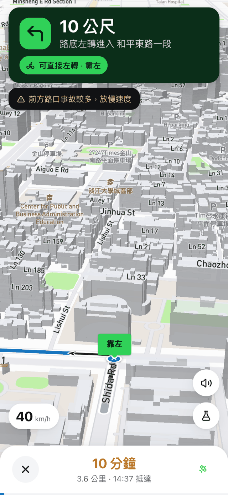
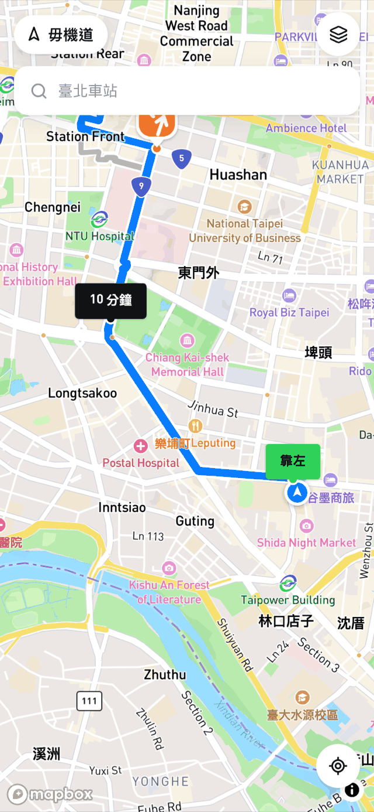
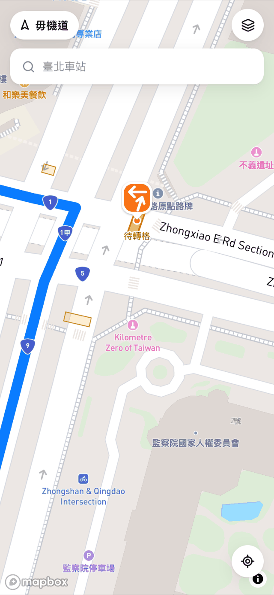
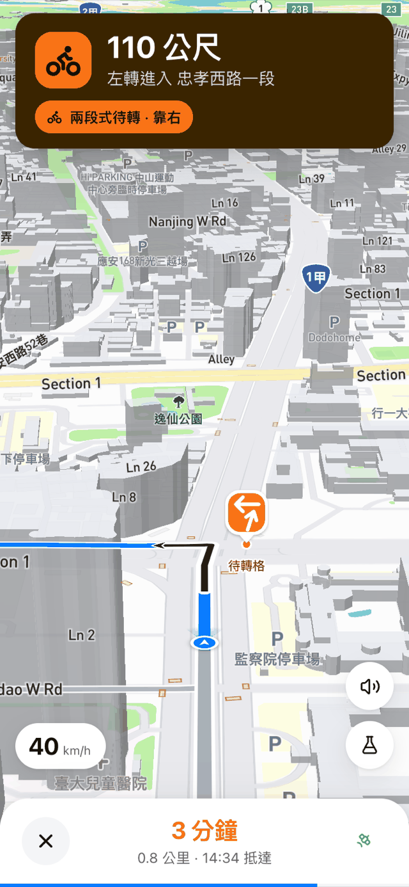
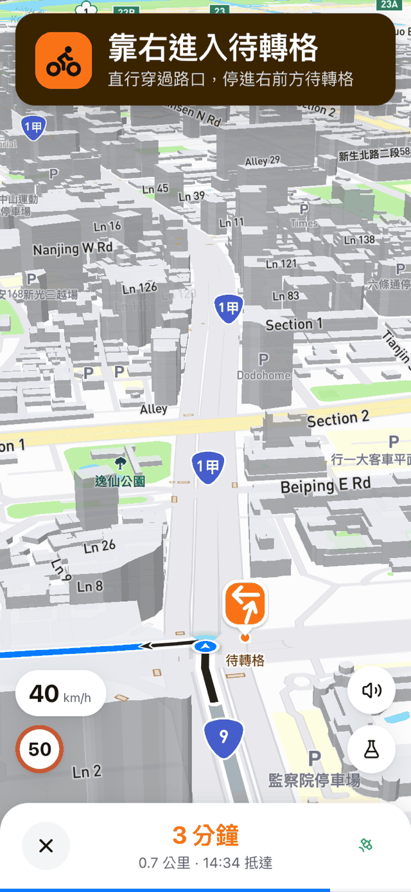
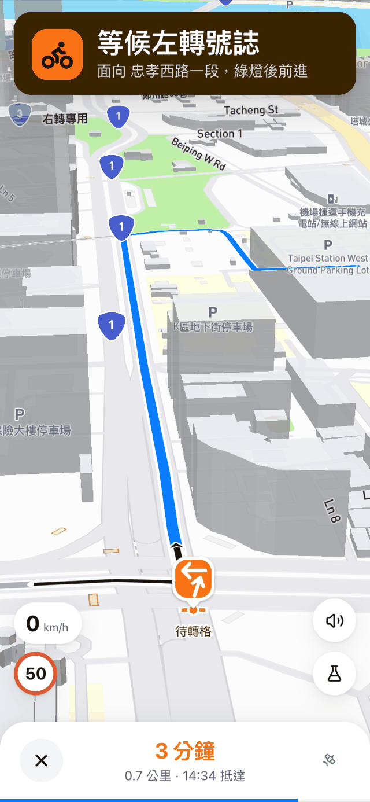
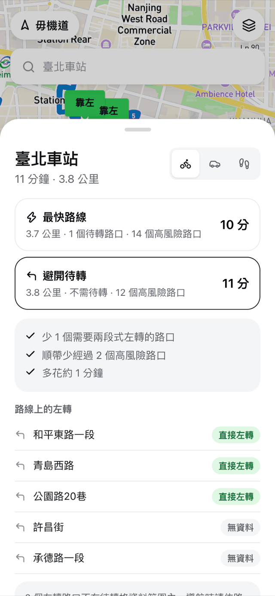

<div align="center">

# 毋機道 HowToTurn

[](https://huggingface.co/SamJiang0223/dieturn-yolo26s-obb)
<br>


**台灣機車專屬的即時導航。每一個左轉路口，都提前告訴你要不要兩段式待轉。**

[前言](#為了讓騎士可以預先知道要靠左還是靠右) ·
[功能](#功能) ·
[待轉格資料與模型](#待轉格資料與模型) ·
[在自己的電腦上執行](#在自己的電腦上執行)

</div>

## 為了讓騎士可以預先知道要靠左還是靠右

因目前各大導航軟體都沒有針對機車族群繪製「待轉格」圖資，所以機車騎士導航至陌生地方時常常會擔心前方的左轉路口是否需要待轉？需要靠左直接左轉還是靠右進入待轉區？如果預判錯誤就可能導致無法挽回的罰單😭，為了解決這個問題，我們嘗試尋找公開的待轉路口資料集，但發現資料相當不齊全，所以就此誕生了這個使用航拍圖來偵測待轉格位置的專案。

毋機道的做法是用 YOLO 從台北市航拍正射影像找出 **1,344 個待轉格**，轉成帶經緯度的圖資，再疊在導航路線的每一個左轉上。讓用戶還沒到路口，就知道該靠哪邊。

## 功能

### 1. 提前提示靠左：可以直接左轉的路口，不用白等一個燈

<table>
  <tr>
    <td width="33%"></td>
    <td width="33%"></td>
    <td width="33%"></td>
  </tr>
  <tr>
    <td align="center">100 公尺前：橫幅轉綠，提示靠左</td>
    <td align="center">路口前：地圖標出「靠左」</td>
    <td align="center">規劃路線時就先標好</td>
  </tr>
</table>

### 2. 待轉區標籤：待轉格畫在地圖上，導航分四階段帶你進格

<table>
  <tr>
    <td width="25%"></td>
    <td width="25%"></td>
    <td width="25%"></td>
    <td width="25%"></td>
  </tr>
  <tr>
    <td align="center">地圖上的待轉格與標籤</td>
    <td align="center">300 公尺前：提前靠右</td>
    <td align="center">60 公尺內：進待轉格</td>
    <td align="center">格內：等候左轉號誌</td>
  </tr>
</table>

### 3. 避開待轉的路線規劃

<table>
  <tr>
    <td width="50%"></td>
    <td width="50%"></td>
  </tr>
  <tr>
    <td align="center">最快路線：1 個待轉路口</td>
    <td align="center">避開待轉：多 1 分鐘，並說明為什麼</td>
  </tr>
</table>

## 待轉格資料與模型

[](https://huggingface.co/SamJiang0223/dieturn-yolo26s-obb)

偵測模型是以 `yolo26s-obb` 微調的旋轉框偵測器，用約 7 cm/px 的台北市正射影像訓練，輸出每個待轉格的四個角點。權重、訓練配方、指標與限制都在 Hugging Face：

**→ [SamJiang0223/dieturn-yolo26s-obb](https://huggingface.co/SamJiang0223/dieturn-yolo26s-obb)**

從航拍圖到 GeoJSON 的完整流程（抓圖、標註、訓練、推論、地理化）見 [docs/PIPELINE.md](docs/PIPELINE.md)。重跑管線後，用下面這行把新圖資匯進 App：

```bash
# 在 repo 根目錄執行，純標準庫，不需 Python venv
python3 geodata/export_app.py
```

## Repo 結構

| 目錄                        | 內容                                                                                        |
| --------------------------- | ------------------------------------------------------------------------------------------- |
| `apps/howtoturn/`           | 本 App（React + Vite），細節見其 [README](apps/howtoturn/README.md)                         |
| `apps/map-viewer/`          | 待轉格圖資的 Mapbox 檢視頁                                                                  |
| `imagery/` `ml/` `geodata/` | 抓航拍圖、訓練與推論、轉世界座標並輸出 GeoJSON，流程見 [docs/PIPELINE.md](docs/PIPELINE.md) |
| `datasets/`                 | 只有標註規範進 git；訓練影像受授權限制不隨 repo 散布                                        |

## 在自己的電腦上執行

### 需求

- **Node.js 20 以上**（建議 LTS）與 npm
- **Mapbox access token**：到 [account.mapbox.com](https://account.mapbox.com/access-tokens/) 建立一個 public token（`pk.` 開頭，免費方案即可）。它是前端 token，打包後會出現在產物裡，請在 Mapbox 後台為它設定 URL 限制。

### 安裝與啟動

```bash
git clone https://github.com/PlanktonLab/HowTurn.git
cd HowTurn/apps/howtoturn
npm install
```

```bash
cp .env.example .env.local
# 編輯 .env.local，填入 VITE_MAPBOX_TOKEN=pk.xxxxx
```

```bash
npm run dev
```

打開 <http://localhost:5173>，按右上角的 ▶ 會載入示範路線（師大 → 臺北車站）。桌機沒有 GPS，路線頁的「模擬」按鈕會沿路線模擬行駛，待轉四階段、語音、偏離重新規劃都跑得到。

### 用手機測試真實 GPS

瀏覽器只在 HTTPS 下開放定位、語音與螢幕常亮，所以手機要用另一個指令：

```bash
npm run dev:phone
```

手機與電腦連同一個 Wi-Fi，用手機開 terminal 印出的 `Network:` 網址。自簽憑證第一次會被擋，按「仍要前往」即可。路線頁按「開始導航」就是真實 GPS 導航。

### 驗證

沒有測試框架，驗證靠兩支腳本。改動待轉判斷後一定要跑第一支：

```bash
npm run check:twostage
```

離線自我一致性測試：拿離線管線推算的服務方向當 ground truth，驗 App 端的待轉判斷。

```bash
npm run check:route -- "121.5288,25.0259" "121.5170,25.0478"
```

對真實路線逐 step 印出待轉判斷（需要 `.env.local` 裡的 token）。

```bash
npm run lint
```

### 打包與部署

```bash
npm run build      # tsc -b && vite build → dist/
npm run preview    # 本機預覽打包結果
```

`apps/howtoturn/vite.config.ts` 使用相對路徑（`base: './'`），`dist/` 放到任何靜態主機或 GitHub Pages 的子路徑都能直接跑，不需改設定。
